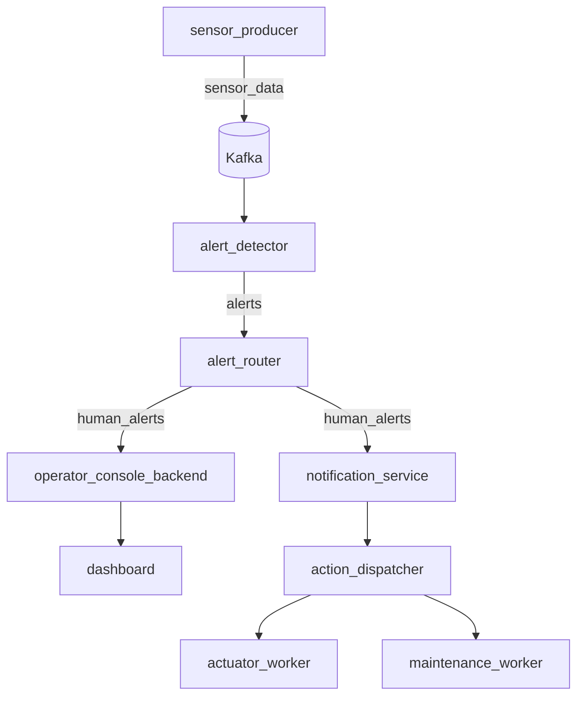
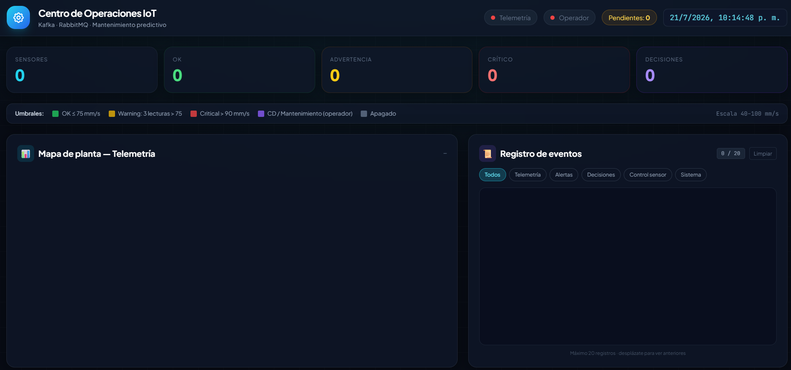
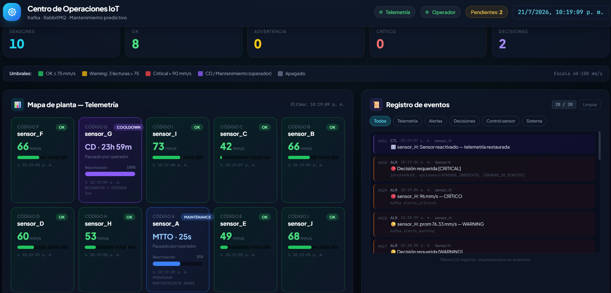

# Plataforma de Mantenimiento Predictivo IoT

## Descripción general

Este proyecto implementa una solución distribuida para el monitoreo y mantenimiento predictivo de equipos industriales. Está diseñado para simular un entorno real de operación donde los sensores publican telemetría en tiempo real, se detectan anomalías en vibración y se generan alertas que pueden ser atendidas por un operador mediante una interfaz web interactiva.

La arquitectura combina microservicios, mensajería asíncrona y comunicación en tiempo real para demostrar un flujo completo de procesamiento de eventos: ingestión, detección, enrutamiento, decisión y control.

## Problema que resuelve

En ambientes industriales, detectar fallas potenciales antes de que se conviertan en averías costosas es clave para reducir tiempos de parada, optimizar mantenimiento y mejorar la seguridad operativa. Este proyecto modela ese flujo mediante un sistema que:

- recopila datos de sensores en tiempo real,
- detecta condiciones anormales,
- genera alertas críticas o de advertencia,
- permite que un operador tome decisiones,
- y aplica acciones de control sobre la simulación del equipo.

## Valor de negocio y técnico

Este proyecto demuestra cómo construir una solución de software orientada a eventos con arquitectura distribuida, aplicando conceptos útiles para entornos reales de industria 4.0, automatización y monitoreo operativo.

### Capacidades principales

- Procesamiento distribuido de eventos
- Comunicación entre servicios mediante Kafka y RabbitMQ
- Visualización en tiempo real de estado de planta
- Alertas operativas con decisiones humanas
- Simulación de acciones de mantenimiento y apagado
- Integración de frontend, backend y mensajería asíncrona

## Arquitectura del sistema

La solución está organizada en dos flujos principales:

1. Flujo de ingestión y análisis en tiempo real con Kafka
2. Flujo transaccional de decisiones y acciones con RabbitMQ



## Tecnologías utilizadas

### Backend y servicios
- Node.js
- Kafka
- RabbitMQ
- WebSockets
- Docker Compose
- REST APIs

### Frontend
- HTML
- CSS
- JavaScript
- Tailwind CSS

## Evidencia visual del proyecto

A continuación se muestran capturas del dashboard y del estado del sistema para ilustrar el funcionamiento del proyecto de forma visual y más atractiva para reclutadores.

### Dashboard con servicios apagados



### Dashboard con servicios activos



## Estructura del proyecto

```text
predictive-maintenance/
├── action_dispatcher/
├── actuator_worker/
├── alert_detector/
├── alert_router/
├── dashboard/
├── maintenance_worker/
├── notification_service/
├── operator_console_backend/
├── plant_monitor_backend/
├── rabbitmq/
├── sensor_producer/
├── docker-compose.yml
└── README.md
```

## Funcionalidades destacadas

- Simulación de múltiples sensores industriales
- Generación automática de alertas de advertencia y criticidad
- Dashboard interactivo para monitorear el estado de la planta
- Notificaciones para operadores y flujo de decisiones
- Manejo de acciones diferidas mediante delayed messages
- Control de estados como apagado, cooldown y mantenimiento

## Cómo ejecutar el proyecto

### Requisitos previos

- Docker Desktop instalado y en ejecución
- Node.js instalado en tu máquina

### Pasos

```bash
cd predictive-maintenance
docker compose up --build -d
```

### Verificar servicios

```bash
docker compose ps
```

### Ejecutar la interfaz web

```bash
start dashboard/dashboard.html
```

## Servicios principales

| Servicio | Función |
| --- | --- |
| sensor_producer | Genera telemetría de sensores y publica eventos |
| alert_detector | Detecta anomalías y emite alertas |
| alert_router | Enruta alertas desde Kafka hacia RabbitMQ |
| plant_monitor_backend | Expone telemetría en tiempo real vía WebSocket |
| operator_console_backend | Entrega alertas al operador en tiempo real |
| action_dispatcher | Recibe decisiones del operador y las enruta a acciones |
| notification_service | Envía alertas a canales de notificación y al panel móvil |
| dashboard | Interfaz visual para monitoreo y control |

## Habilidades demostradas

Este proyecto permite evidenciar competencias en:

- desarrollo de aplicaciones distribuidas,
- arquitectura orientada a eventos,
- integración con sistemas de mensajería,
- implementación de comunicación en tiempo real,
- diseño de APIs y microservicios,
- trabajo con contenedores y orquestación local,
- y construcción de interfaces interactivas para monitoreo operativo.

## Nota para recruiters

Este proyecto fue desarrollado con un enfoque de ingeniería de software aplicada a escenarios industriales. No solo demuestra conocimiento técnico, sino también capacidad para pensar en sistemas escalables, resilientes y conectados a flujos reales de negocio.

## Autor

Diery Valencia

docker logs -f maintenance_worker
```

> Para pruebas locales más rápidas (barra CD / reactivación), sobreescribe en `docker-compose.yml`
> `DELAY_10MIN_MS` y `DELAY_24H_MS` en **sensor_producer** y **action_dispatcher** (ej. `"30000"` = 30 s).

### Impacto real de decisiones del operador

Tras `POST /decide`, `action_dispatcher` notifica a `sensor_producer` (`POST /control`):

| Decisión | Efecto en simulación |
| :--- | :--- |
| **APAGADO_INMEDIATO** | Sensor `SHUTDOWN` — deja de publicar en `sensor_data` |
| **IGNORAR_10_MINUTOS** | Sensor `COOLDOWN` — barra CD en dashboard, reactivación automática |
| **RECONOCER_Y_ESPERAR_24H** | `COOLDOWN` prolongado (24 h por defecto) |
| **PROGRAMAR_MANTENIMIENTO_AHORA** | `MAINTENANCE` ~45 s sin lecturas, luego vuelve a `OK` |

---

## ✅ Cumplimiento del Enunciado (Ejercicio 3)

| Requisito | Estado |
| :--- | :--- |
| Arquitectura híbrida Kafka + RabbitMQ | ✅ |
| 8 microservicios + brokers en Docker Compose | ✅ |
| Ventana móvil stateful + reglas >90 / 3×>75 | ✅ |
| Particionamiento por `sensor_id` (key) | ✅ |
| Tópico `sensor_status` consumido por `plant_monitor_backend` | ✅ |
| Fanout `human_alerts` + opciones aleatorias (orden barajado) | ✅ |
| Mensaje RabbitMQ: `{ alert_id, sensor_id, type, options }` | ✅ |
| Exchange Direct `actions_direct` para comandos | ✅ |
| Delayed Exchange: 24 h y 10 min (`x-delay`) | ✅ |
| `POST /decide` en `action_dispatcher` | ✅ |
| Dashboard: WS :8081 + :8082 + decisión al dispatcher | ✅ |

---

## 🧹 Limpiar y Detener Infraestructura

Para detener todos los servicios y remover volúmenes de red asociados:
```bash
docker compose down -v
```
